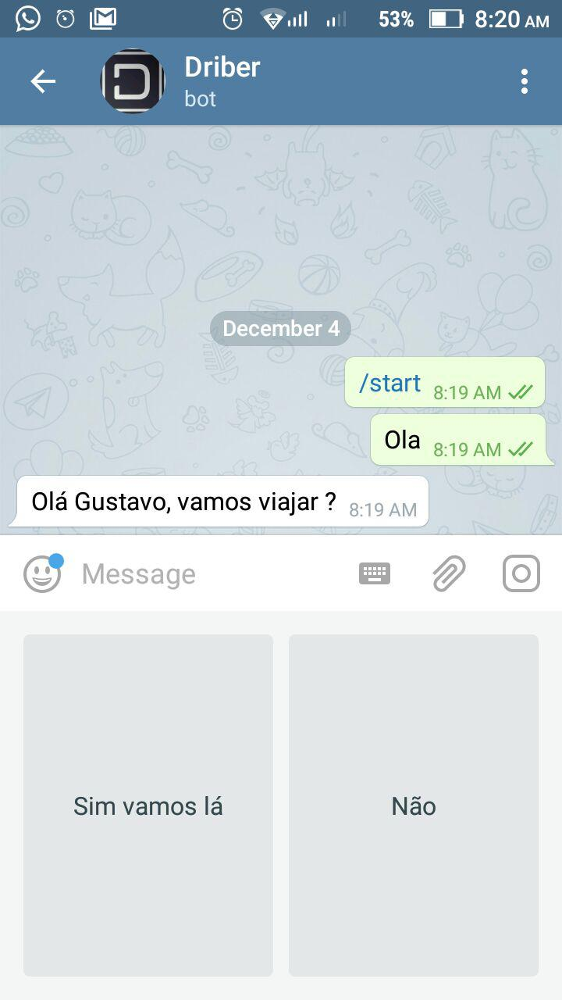
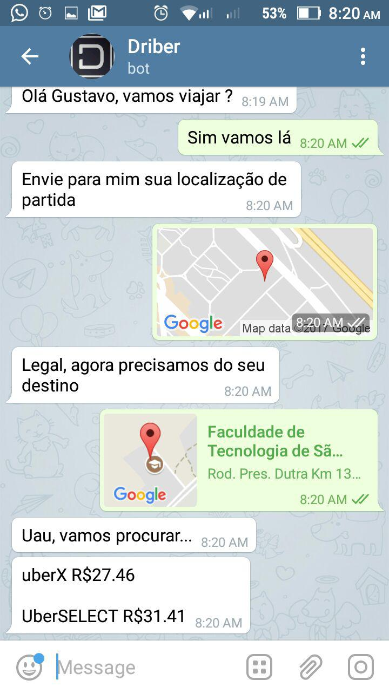
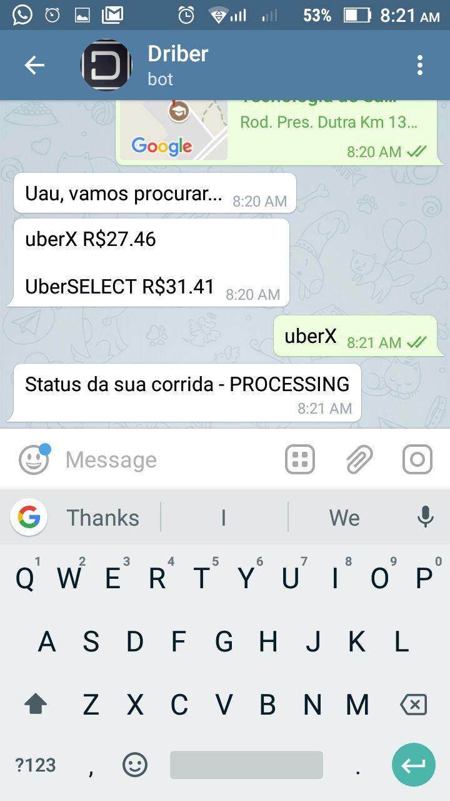

## DRIBER

Bot to request a Uber ride through Telegram.
This bot is just a simulation of a Uber request. No real drivers will be requested, but you may see the ride simulation through Uber Trip Simulator (only available for the user who requested the ride).

Developed by:
Gustavo Santos Thiago
Heitor Miranda Moreira

### How to request a ride?
1. First of all, you have to start the conversation with the bot
2. Then you have to choose to request a ride
3. After that, you will be asked to send your pickup and dropoff locations. You must send them using Telegram Location attachment
4. The bot will then search for drivers nearby and show the estimated fares for each available product (uberX, uberSELECT, uberPOOL etc.)
5. There will be a button for each one of the available products. You may choose the one you want to request.
6. Uber will be re

### Interaction
Starting the conversation with the bot:

Requesting a ride:

Choosing the product:

Checking the current status of your ride:

Checking the progress of the ride with Uber Trip Simulator:

### Class Diagram

